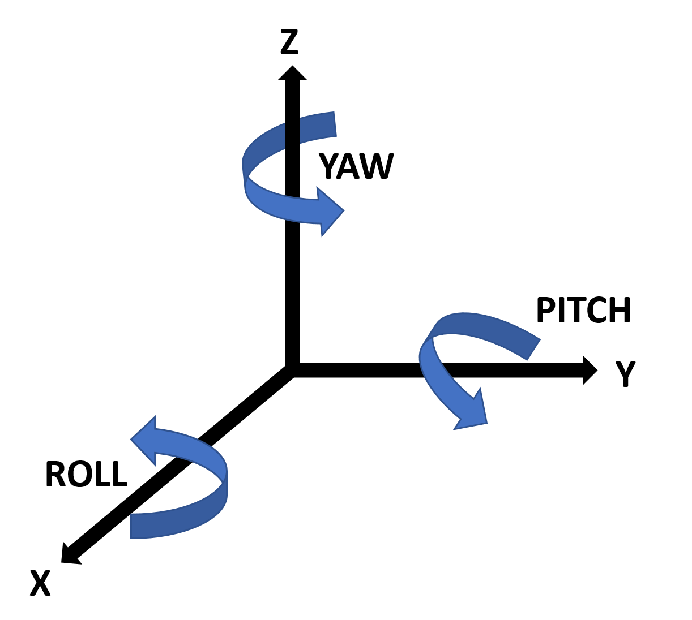

# Open Virtual Steering with MotionIMU & Bluefruit

The **Romans** knew it already: _"Sterzare Necesse Est!"_ (free after Plutarch), and it still holds true in the world of **virtual cycling**.

What it means

  
The original quote **Navigare Necesse Est** ("To Sail is Necessary") was humorously adapted here by replacing _Navigare_ with the Italian verb for [**steering**](https://en.wiktionary.org/wiki/sterzare), aligning it with the project's theme.

This repo is part of the **Open Virtual Steering (OVS)** initiative, a research-driven open-source project exploring **alternative input methods** for **steering in virtual cycling platforms**. 

## 🧭 Motion-Based Steering with _Inertial Measurement Unit_ (IMU)

This repository focuses on using an **MPU-6050 IMU** sensor, a 3-axis accelerometer + 3-axis gyroscope, to detect the rider's **handlebar turning and/or bike leaning** and convert that motion into **steering commands**. [See Wikipedia for Natural Bike Dynamics](https://en.wikipedia.org/wiki/Bicycle_and_motorcycle_dynamics).
- 🌀 **MPU-6050**: Low-cost, I²C-compatible motion sensor
- 🎮 **Use case**: _Shift your weight and lean the bike_ and/or turn the handlebar, to steer the avatar
- ⚙️ **Filtering** and **smoothing** algorithms provided

## 📚 Related OVS Repositories
- [`Bluefruit-Steering-Server`](https://github.com/Berg0162/Bluefruit-Steering-Server) - Critical Shared Backend (Arduino library)
- [`Open-Virtual-Steering-DiscreteHID-Bluefruit`](https://github.com/Berg0162/Open-Virtual-Steering-DiscreteHID-Bluefruit) – Buttons, Joysticks, Rotary Encoder  

## 🧭 How It Works

This firmware functions as a **Bluefruit Steering Controller**, structured around two main building blocks:

1. 🧱 **BluefruitSteeringServer**  
   A reusable BLE library responsible for advertising, pairing, and sending steering data using a BLE steering profile.

2. 🎮 **Motion-Based HID Handler**  
   This repository uses an **MPU6050 motion sensor** to interpret **roll** and **yaw** movement of the bike or handlebars. Sensor data is processed using Kalman and EMA filters, and converted into smooth, real-time steering angles.

The firmware continuously monitors motion, filters out noise and unintentional movement (like out-of-saddle rocking), and sends validated steering commands via `BLESteeringServer::updateSteeringValue()`.

## 🌀 MPU-6050
The MPU-6050 is a 6-axis (combines 3-axis Gyroscope plus 3-axis Accelerometer) motion tracking devices. Changes in motion, acceleration and rotation can be detected. It is commonly used in robotics, gaming controllers, and other electronic devices that require motion detection. Its high accuracy and low cost make it very popular among the DIY community.  

 
Put MPU-6050 flat on the table, assure that the face with label is upward and a dot on this surface is on the top left corner. Then the upright direction upward is the z-axis of the chip. The direction from left to right is regarded as the X-axis. Accordingly the direction from back to front is defined as the Y-axis. The MPU-6050’s onboard Digital Motion Processor (<b>DMP</b>) offloads processing that would normally have to take place on the microprocessor. It maintains an internal buffer that combines data from the gyro and accelerometer and computes orientation. The <b>DMP</b> also takes care of the applying the offsets. 
 

A comprehensive description of the MPU-6050 can be found on [MPU-6050 Explained](https://mjwhite8119.github.io/Robots/mpu6050). 
The <b>DMP</b> pre-processed MPU-6050 data is next handled in firmware code using:
- Complementary filtering
- Motion thresholds
- Optional dead zones for stable centering

## 🧱 Dependencies

+ [Adafruit nRF52 Arduino Core](https://github.com/adafruit/Adafruit_nRF52_Arduino)
+ [Adafruit Bluefruit Library (Source)](https://github.com/adafruit/Adafruit_nRF52_Arduino/tree/master/libraries/Bluefruit52Lib)
+ [BluefruitSteeringServer](https://github.com/Berg0162/Bluefruit-Steering-Server)
> 💡 This library is built specifically for **Adafruit's Bluefruit platform**, and is not compatible with NimBLE-based ESP32 boards.

### **Supported MCU Boards**
+ Nordic Semiconductor **nRF52 series**
  - 🟢 Adafruit Feather nRF52840 Express
  - 🟢 Adafruit ItsyBitsy nRF52840
  - 🟢 Adafruit CLUE, Bluefruit Sense, and other nRF52 boards with BLE support

To install the core:
- Follow Adafruit's guide: [Install Adafruit nRF52 Arduino Core](https://learn.adafruit.com/bluefruit-nrf52-feather-learning-guide/arduino-bsp-setup)

## 🧪 Testing & Validation

Testing was conducted using [**nRF Connect for Mobile**](https://www.nordicsemi.com/Products/Development-tools/nRF-Connect-for-mobile), a BLE inspection app used to:
- Scan and connect to the BLE server
- Monitor characteristic notifications
- Confirm responsive and smooth steering behavior

The IMU’s angle mapping was adjusted to ensure **stable, realistic steering behavior** while avoiding overcorrection or jitter from natural bike motion.

## ⚠️ Disclaimer

💡 <b>Research & Independence</b>

This project is <b>not affiliated with, endorsed by, or associated with any commercial virtual cycling platform or steering device manufacturer</b>. It is a <b>research and interoperability</b> initiative designed to explore <b>alternative human interface methods</b> in the context of indoor cycling. All development is conducted independently for <b>educational and experimental purposes</b>.

✅ <b>Compliance & Responsibility</b>

This repository does <b>not include or promote any circumvention of technological protection measures</b>, reverse engineering of proprietary software, or unauthorized access to restricted systems. Users are <b>solely responsible</b> for ensuring that their use of this code complies with <b>local laws, software licenses, and platform terms of service</b>.

🔍 <b>Copyright & Contact</b>

If you are a <b>rights holder</b> and believe this project includes content that <b>violates your intellectual property rights</b>, please <b>open an issue</b> in this repository. We are committed to responding promptly and respectfully to legitimate concerns.

## 🧭 Mounting the MPU-6050: Axis Alignment Matters

For **instant steering detection**, it is essential to follow exactly how the code **aligns the MPU-6050's axes with the bike frame**, study the instructional picture above.

- 🔵 The **X-axis** (labeled) will point **backward/forward**, parallel to the virtual direction of travel. This axis is used to detect **ROLL/leaning movement**.
- 🔴 The **Z-axis**, which points out of the chip surface (perpendicular to the board), should align **vertically**. This is used to detect **YAW/rotation** of the handlebars.
- 🟢 The **Y-axis** (labelled) should align with the **side-to-side axis** of the bike. This axis is used to detect **PITCH movement**, but is not used for steering in this implementation.

> ❗ **Different mounting** (e.g., upside down, rotated, or skewed) will lead to inverted or erratic steering behavior.

💡 If you need to invert or compensate for mounting differences, the code allows you to **invert the signs of X- and Y-axis** and the **MPU-6050_light library** even has an option for **upside down mounting**.

## 🧠 Motion-Based Steering Processing Pipeline

This device is enabling natural steering movements with <b>your handlebars</b> and <b>your body position</b>! Shifting body position (a.k.a. **leaning**) is only possible when your indoor bike setup allows for, **with a rocker plate**! The present code is optimized for natural steering even during the **heavy wobbling conditions** of a rocker plate! `Wobbling -> Noise -> Spurious Sensor Drift!`  
The code can detect the difference between **leaning and rocking the bike**. It was a challenge to separate actual steering from natural cycling movements. Afterall, the body movement to keep the pedals turning, induces distinctive bike movements! With a **rocker-plate-bike-setup**, steering is as natural as possible. Leaning to the right or left is detected in combination with turning the handlebars and amplify the effect on the avatar! 

The `getSteeringState()` function processes motion data from the MPU6050 sensor to produce a **steering value** based on the rider’s **handlebar movements (Yaw)** and **leaning (Roll)**. Here’s a high-level breakdown of the processing steps:

1. **Data Acquisition**  
   - The sensor is sampled in a short loop (≈44 ms total).  
   - Raw angle readings are taken from the **Z-axis (Yaw)** and **X-axis (Roll)**.

2. **Noise Reduction**  
   - Each reading is processed through a **Kalman filter** and an **Exponential Moving Average (EMA)** filter.  
   - This reduces measurement noise and improves stability for steering detection.

3. **Statistical Filtering**  
   - The **standard deviation** between current and previous angles is calculated.  
   - This helps differentiate between real steering input and unwanted noise or spontaneous drift.

4. **Direction and Validity Check**  
   - Yaw and Roll data are compared to determine **coherent movement** (i.e., leaning and turning in the same direction).  
   - If both indicate a turn (left or right), the movement is considered intentional steering.

5. **Yaw Offset Update**  
   - If yaw deviation exceeds a defined threshold, the baseline yaw angle is updated (to account for drift or re-orientation).

6. **Rocking Detection**  
   - Excessive roll deviation is flagged as **rocking motion**, which disables steering output to avoid false input from out-of-saddle riding.

7. **Final Output**  
   - If the motion is valid and not considered rocking, a **combined yaw + roll steering value** is returned.  
   - This value is later encoded and sent to the BLE client as **steering control data**.

---

⚖️ <b>Legal Notice (EU Context)</b>

This project is developed and published in accordance with **EU directives** that recognize the right to study, test, and develop software components for the purpose of achieving **interoperability** (e.g., Directive 2009/24/EC on the legal protection of computer programs, Article 6).  

No part of this project is intended to **infringe upon intellectual property rights** or violate technological protection measures. All content is shared in good faith under the belief that it falls within the bounds of **legitimate research, reverse engineering for interoperability, and fair use under EU law**.  

Users must ensure their own compliance with **national implementations of EU directives**, and are responsible for how they apply or modify this code.

---

> 🧠 Contributions and discussions are welcome! Feel free to fork, experiment, or share your ideas for smarter indoor cycling interaction.
